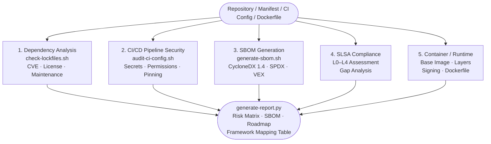

# Supply Chain Security Auditor

A comprehensive Claude Code skill for auditing software projects against supply chain security threats, including dependency analysis, CI/CD pipeline validation, and SBOM generation with framework compliance mapping (NIST SP 800-218A, EU AI Act, OpenSSF, CISA).

## Features

- **Dependency Analysis**: Inventory, vulnerability scanning, license compliance, maintenance status
- **Build Pipeline Security**: CI/CD audit (GitHub Actions, GitLab CI, Jenkins), secret detection, artifact signing
- **SBOM Generation**: CycloneDX and SPDX formats with VEX statements
- **SLSA Compliance**: Current level assessment and gap analysis
- **Runtime Security**: Container image analysis and registry trust
- **Framework Mapping**: NIST 800-218A, EU AI Act Article 25, OpenSSF Scorecard, CISA, ISO 42001, ENISA 2025

## Installation

```bash
git clone git@github.com:justice8096/supply-chain-security.git ~/.claude/plugins/supply-chain-security
```

## Usage

Trigger the skill by mentioning:
- "supply chain", "SBOM", "dependency audit"
- "are my dependencies safe", "license check"
- "SLSA", "software bill of materials"
- "check my package.json", "vulnerability scan"
- "container security", "image scan"

Or share a dependency file (package.json, requirements.txt, Cargo.toml, go.mod) with security questions.

## Audit Flow

The five audit dimensions converge into a single structured report:



## Project Structure

```
supply-chain-security/
├── .claude-plugin/
│   └── plugin.json                    # Plugin configuration
├── skills/
│   └── supply-chain-auditor/
│       ├── SKILL.md                   # Main skill definition
│       ├── references/
│       │   ├── sbom-guide.md          # SBOM generation guide
│       │   ├── slsa-framework.md      # SLSA levels reference
│       │   ├── supply-chain-threats.md # Attack patterns
│       │   └── framework-mapping.md   # Compliance framework mapping
│       └── scripts/
│           ├── generate-sbom.sh       # CycloneDX SBOM generation
│           ├── check-lockfiles.sh     # Lockfile integrity check
│           ├── audit-ci-config.sh     # CI/CD configuration audit
│           └── generate-report.py     # Report generation
├── evals/
│   └── evals.json                     # Test cases
├── LICENSE                             # MIT License
└── README.md                           # This file
```

## Framework Coverage

### Standards & Frameworks
- **NIST SP 800-218A (SSDF)**: Secure Software Development Framework
- **EU AI Act Article 25**: Technical documentation and governance
- **OpenSSF Scorecard**: Open source security best practices
- **CISA Secure Software Development**: 8 critical controls
- **ISO 42001**: AI Management System requirements
- **ENISA 2025**: Strengthening Supply Chain Security
- **SLSA v1.0**: Supply chain Levels for Software Artifacts

## Audit Dimensions

### 1. Dependency Analysis
- Direct and transitive inventory
- CVE/NVD vulnerability scanning
- License compliance (GPL contamination, compatibility)
- Maintenance status (last update, open issues, bus factor)
- Typosquatting risk assessment
- Version pinning analysis

### 2. Build Pipeline Security
- CI/CD configuration validation
- Third-party action/plugin trust
- Secret management (hardcoded vs vault/OIDC)
- Build reproducibility
- Artifact signing and provenance (Sigstore, cosign)

### 3. SBOM & Inventory
- CycloneDX and SPDX generation
- Component metadata with licenses
- VEX (Vulnerability Exploitability eXchange) statements

### 4. SLSA Compliance
- Current level (L0-L4) determination
- Gap analysis to next level
- Provenance verification

### 5. Runtime Supply Chain
- Container base image analysis
- OCI image layer inspection
- Registry trust and signing validation

## Dependencies

- bash 4.0+
- python 3.8+
- Optional: syft (SBOM generation), cosign (artifact verification)

## License

MIT - See LICENSE file

## Author

Justice
